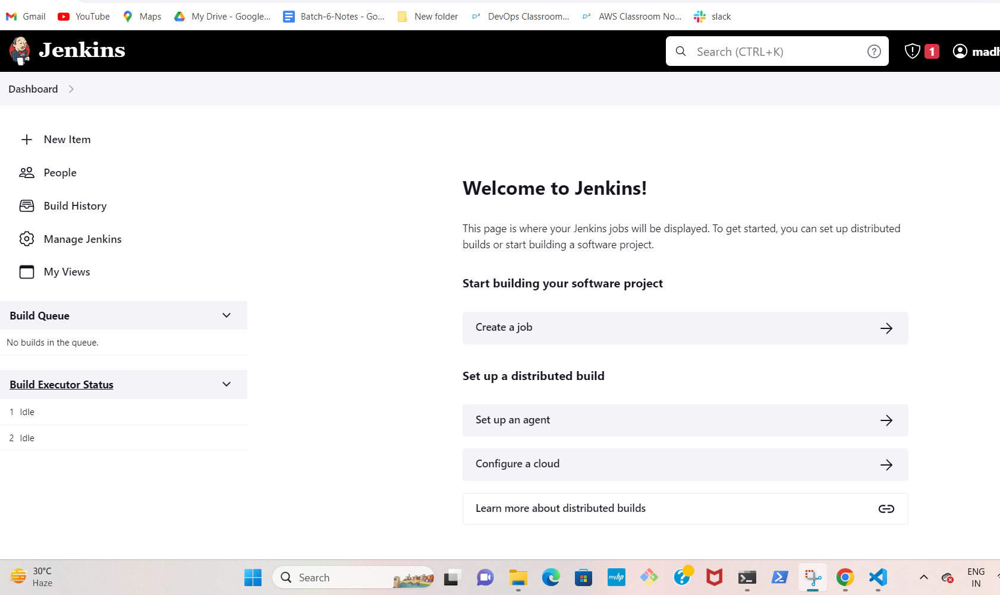

#  SPRINGPETCLINIC APPLICATION 
   ----------------------------

### SPRINGPETCLINIC APPLICATION MANUAL STEPS:

```
sudo apt update
sudo apt install openjdk-17-jdk -y
sudo apt install maven -y
git clone https://github.com/spring-projects/spring-petclinic.git
cd spring-petclinic
./mvnw package
java -jar target/*.jar

```
### CREATE JENKINS PIPELINE FOR SPRINGPETCLINIC APPLICATION:

* Create two ec2 machines, one is jenkins master and other is jenkins node

* In jenkins master install java-17 version and install jenkins and once install jenkins we will check jenkins users list and give "permissions" and changes "password authentication" no to "yes" to that jenkins user
* In jenkins node install java-17 version and maven
* Next go to the browser give '<jenkins master ip>:8080' and open jenkinspage after that we will get one path from jenkins then we will get into path by using sudo cat/<path> and entered into the page



* After we will configure master with node by using ssh-username,password,label,node ip-address.Next we will check agent is connect or not.If the agent is connected to the jenkins we will start the next process
 


* Next we will install docker in jenkins master and create the container with sonarqube latest image after go to browser and give '<jenkins master ip>:9000' open the sonarqube account.Login with  username and password generate token it will give some secrete key.Go to the jenkins===>Manage jenkins===>Manage Pluggins===>Available Pluggins===>
install sonarqube scanner pluggin and go to the configuration system configure sonarqube scanner with generated token


* Next we will create jfrog account sign in with github account and login to the account and create maven package and create one  repository and genertae token and copy the secrete key.Next go to the jenkins===>Manage jenkins===> Manage Pluggins===>Available Pluggins===>Arifactory and go to the configure system configure jfrog with generated token and username.


 

* Next check the jfrog test connection

 
* After give the tools configuration to the maven

 
* After create user in both jenkins master and jenkins node and give sudo permissions to the user and change the password authentication no to yes. 
* Next configure the jenkins node with private ip to the  jenkins master (ssh-copy-id <username>@privateip of node) in master
* Next install ansible on jenkins master
```
 sudo apt update
 sudo apt install software-properties-common
 sudo add-apt-repository --yes --update ppa:ansible/ansible
 sudo apt install ansible
 ansible --version

``` 
* Next write hostfile, springpectclinic servicefile and springpetclinic playbook and run this playbook in jenkins master
* After deploy application using ansible
```
pipeline {
    agent { label 'UBUNTU_NODE1' }
    stages {
        stage('vcs') {
            steps {
                git url: 'https://github.com/Madhuri-chinta/spring-petclinic.git',
                    branch: 'develop'
            }
        }
        stage('package') {
            steps {
                sh './mvnw package'
            }
        }
        stage('sonarqube analysis') {
            steps {
                withSonarQubeEnv('madhuri') {
                    sh 'mvn clean package sonar:sonar'
                }
            }
        } 
        stage ('Artifactory configuration') {
            steps {
            
                rtMavenDeployer (
                    id: "jfrog",
                    serverId: "madhuri",
                    releaseRepo: "madhuri",
                    snapshotRepo: "madhuri"
                )
            }
        }

        stage ('Exec Maven') {
            steps {
                rtMavenRun (
                    tool: "MAVEN_GOAL", // Tool name from Jenkins configuration
                    pom: 'pom.xml',
                    goals: 'clean install',
                    deployerId: "jfrog"
                )
            }
        }

        stage ('Publish build info') {
            steps {
                rtPublishBuildInfo (
                    serverId: "madhuri"
                )
            }
        }   
        stage('post build') {
            steps {
                archiveArtifacts artifacts: '**/target/*.jar',
                                 onlyIfSuccessful: true
                junit testResults: '**/surefire-reports/TEST-*.xml'
            }
        }
        stage('deploy') {
            agent any
            steps {
                sh 'ansible -i ./ansible/hosts -m ping all'
                sh 'ansible-playbook -i ./ansible/hosts ./ansible/spc.yaml'
            }
        }    
    }
}

```
* After go to the github account and create the git hub token it gives some secretekey 


 
* Next go to the our springpetclinic repository and go to the settings and create webhook


* Afetr jenkins page install github pullrequest builder and configure the pluggin with secret text

 
* Next create freestyle project and set up the pull request process


* This springpetclinc application is in develop branch and create & checkout the feature branch
* Some changes in feature branch and pull request to the develop branch if it is code is correct the build is automatically triggered and accept the pull request in develop branch


 
       